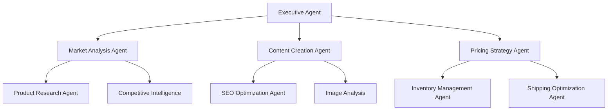

# FlipSync Agent Coordination Guide
## Comprehensive Multi-Agent Orchestration Framework

**Created**: 2025-06-24  
**Version**: 2.0  
**Status**: ✅ **ACTIVE COORDINATION STANDARD**  
**Authority**: PRIMARY COORDINATION REFERENCE

---

## 🎯 **OVERVIEW**

FlipSync operates as a sophisticated **39-agent ecosystem** with hierarchical coordination patterns enabling autonomous e-commerce automation. This guide provides the definitive framework for understanding, implementing, and optimizing multi-agent coordination workflows.

### **Core Coordination Principles**
- **Hierarchical Delegation**: Executive agents coordinate specialist agents
- **Asynchronous Communication**: Event-driven agent interactions
- **Shared Knowledge**: Centralized knowledge repository for agent insights
- **Adaptive Decision Making**: Intelligent routing based on context and capability
- **Fault Tolerance**: Graceful degradation and agent failover mechanisms

---

## 🏗️ **AGENT ARCHITECTURE HIERARCHY**

### **Tier 1: Executive Coordination Layer**
```
Executive Agent (fs_agt_clean/agents/executive/)
├── Strategic Planning & Resource Allocation
├── Cross-Agent Workflow Orchestration  
├── Performance Monitoring & Optimization
└── Conflict Resolution & Priority Management
```

**Responsibilities**:
- Coordinate complex multi-agent workflows
- Allocate resources across agent teams
- Monitor system-wide performance metrics
- Resolve inter-agent conflicts and dependencies

### **Tier 2: Specialized Domain Agents**

#### **Market Intelligence Cluster**
```
Market Analysis Agent (fs_agt_clean/agents/market_analysis/)
├── Competitive Intelligence Gathering
├── Price Trend Analysis & Forecasting
├── Market Opportunity Identification
└── Demand Pattern Recognition

Product Research Agent (fs_agt_clean/agents/product_research/)
├── Product Viability Assessment
├── Market Fit Analysis
├── Competitor Product Mapping
└── Trend-Based Product Discovery
```

#### **Content Generation Cluster**
```
Content Creation Agent (fs_agt_clean/agents/content_creation/)
├── AI-Powered Listing Generation
├── SEO-Optimized Title Creation
├── Description Enhancement
└── Image Analysis & Tagging

SEO Optimization Agent (fs_agt_clean/agents/seo_optimization/)
├── Keyword Research & Integration
├── Cassini Algorithm Optimization
├── Search Ranking Enhancement
└── Content Performance Analysis
```

#### **Operations Management Cluster**
```
Inventory Management Agent (fs_agt_clean/agents/inventory_management/)
├── Stock Level Monitoring
├── Automated Reordering
├── Multi-Platform Sync
└── Inventory Optimization

Pricing Strategy Agent (fs_agt_clean/agents/pricing_strategy/)
├── Dynamic Pricing Algorithms
├── Competitor Price Monitoring
├── Profit Margin Optimization
└── Market-Based Price Adjustments
```

### **Tier 3: Platform Integration Agents**

#### **Marketplace Connectors**
```
eBay Integration Agent (fs_agt_clean/agents/ebay_integration/)
├── Listing Management & Optimization
├── Order Processing & Fulfillment
├── Performance Metrics Tracking
└── Policy Compliance Monitoring

Amazon Integration Agent (fs_agt_clean/agents/amazon_integration/)
├── FBA Workflow Management
├── Sponsored Product Campaigns
├── Inventory Sync & Management
└── Performance Analytics
```

#### **Logistics & Fulfillment**
```
Shipping Optimization Agent (fs_agt_clean/agents/shipping_optimization/)
├── Carrier Rate Comparison
├── Dimensional Weight Optimization
├── Shipping Arbitrage Calculation
└── Delivery Time Optimization

Order Management Agent (fs_agt_clean/agents/order_management/)
├── Multi-Platform Order Aggregation
├── Fulfillment Workflow Automation
├── Customer Communication
└── Returns Processing
```

---

## 🔄 **COORDINATION PATTERNS**

### **Pattern 1: Hierarchical Task Delegation**



**Implementation**:
1. **Executive Agent** receives high-level business objective
2. **Task Decomposition** breaks objective into specialized sub-tasks
3. **Agent Selection** identifies optimal agents for each sub-task
4. **Parallel Execution** coordinates simultaneous agent operations
5. **Result Aggregation** combines outputs into cohesive solution

### **Pattern 2: Event-Driven Coordination**

```python
# Agent Coordination Event System
class AgentCoordinationEvent:
    def __init__(self, event_type: str, source_agent: str, target_agents: List[str], payload: Dict):
        self.event_type = event_type
        self.source_agent = source_agent
        self.target_agents = target_agents
        self.payload = payload
        self.timestamp = datetime.now()

# Example: Product Listing Workflow
async def coordinate_product_listing(product_data: Dict):
    # 1. Market Analysis Agent analyzes viability
    market_event = AgentCoordinationEvent(
        event_type="MARKET_ANALYSIS_REQUEST",
        source_agent="executive_agent",
        target_agents=["market_analysis_agent"],
        payload={"product_data": product_data}
    )
    
    # 2. Content Creation Agent generates listing
    content_event = AgentCoordinationEvent(
        event_type="CONTENT_GENERATION_REQUEST", 
        source_agent="market_analysis_agent",
        target_agents=["content_creation_agent"],
        payload={"market_insights": market_results}
    )
    
    # 3. Pricing Strategy Agent optimizes pricing
    pricing_event = AgentCoordinationEvent(
        event_type="PRICING_OPTIMIZATION_REQUEST",
        source_agent="content_creation_agent", 
        target_agents=["pricing_strategy_agent"],
        payload={"listing_content": content_results}
    )
```

### **Pattern 3: Knowledge Sharing & Learning**

```python
# Shared Knowledge Repository
class AgentKnowledgeRepository:
    def __init__(self):
        self.knowledge_store = {}
        self.agent_insights = {}
        self.performance_metrics = {}
    
    async def share_insight(self, agent_id: str, insight_type: str, data: Dict):
        """Agents share insights for collective learning"""
        insight = {
            "agent_id": agent_id,
            "insight_type": insight_type,
            "data": data,
            "timestamp": datetime.now(),
            "confidence_score": data.get("confidence", 0.8)
        }
        
        # Store insight for other agents to access
        if insight_type not in self.agent_insights:
            self.agent_insights[insight_type] = []
        self.agent_insights[insight_type].append(insight)
        
        # Notify relevant agents of new insight
        await self.notify_interested_agents(insight_type, insight)
    
    async def get_relevant_insights(self, agent_id: str, context: str) -> List[Dict]:
        """Retrieve insights relevant to current agent context"""
        relevant_insights = []
        for insight_type, insights in self.agent_insights.items():
            if self.is_relevant_to_context(insight_type, context):
                relevant_insights.extend(insights)
        return relevant_insights
```

---

## 🚀 **COORDINATION WORKFLOWS**

### **Workflow 1: Complete Product Launch**

**Objective**: Launch new product from research to live marketplace listing

**Agent Sequence**:
1. **Product Research Agent** → Identifies viable product opportunities
2. **Market Analysis Agent** → Validates market demand and competition
3. **Content Creation Agent** → Generates optimized listing content
4. **SEO Optimization Agent** → Enhances content for search visibility
5. **Pricing Strategy Agent** → Calculates optimal pricing strategy
6. **Inventory Management Agent** → Sets up inventory tracking
7. **eBay Integration Agent** → Creates live marketplace listing
8. **Shipping Optimization Agent** → Configures shipping parameters

**Coordination Logic**:
```python
async def execute_product_launch_workflow(product_idea: str):
    workflow_context = WorkflowContext(
        workflow_id="product_launch",
        initiated_by="user_request",
        product_idea=product_idea
    )
    
    # Stage 1: Research & Validation
    research_results = await coordinate_agents([
        "product_research_agent",
        "market_analysis_agent"
    ], workflow_context)
    
    if research_results.viability_score < 0.7:
        return WorkflowResult(status="REJECTED", reason="Low viability")
    
    # Stage 2: Content Creation
    content_results = await coordinate_agents([
        "content_creation_agent", 
        "seo_optimization_agent"
    ], workflow_context.with_data(research_results))
    
    # Stage 3: Pricing & Setup
    setup_results = await coordinate_agents([
        "pricing_strategy_agent",
        "inventory_management_agent"
    ], workflow_context.with_data(content_results))
    
    # Stage 4: Marketplace Launch
    launch_results = await coordinate_agents([
        "ebay_integration_agent",
        "shipping_optimization_agent"
    ], workflow_context.with_data(setup_results))
    
    return WorkflowResult(
        status="SUCCESS",
        product_listing_id=launch_results.listing_id,
        estimated_revenue=setup_results.revenue_projection
    )
```

### **Workflow 2: Dynamic Pricing Optimization**

**Objective**: Continuously optimize pricing across all active listings

**Agent Coordination**:
```python
async def execute_pricing_optimization_workflow():
    # 1. Market Analysis Agent monitors competitor pricing
    market_data = await market_analysis_agent.get_competitor_pricing()
    
    # 2. Pricing Strategy Agent calculates optimal prices
    pricing_recommendations = await pricing_strategy_agent.optimize_prices(
        market_data=market_data,
        inventory_levels=await inventory_management_agent.get_stock_levels(),
        sales_velocity=await order_management_agent.get_sales_metrics()
    )
    
    # 3. eBay Integration Agent implements price changes
    for recommendation in pricing_recommendations:
        if recommendation.confidence_score > 0.8:
            await ebay_integration_agent.update_listing_price(
                listing_id=recommendation.listing_id,
                new_price=recommendation.optimal_price
            )
    
    # 4. Performance Monitoring Agent tracks results
    await performance_monitoring_agent.track_pricing_changes(
        pricing_recommendations
    )
```

---

## 📊 **COORDINATION MONITORING**

### **Agent Performance Metrics**

```python
class AgentCoordinationMetrics:
    def __init__(self):
        self.workflow_success_rates = {}
        self.agent_response_times = {}
        self.coordination_efficiency = {}
        self.error_rates = {}
    
    async def track_workflow_performance(self, workflow_id: str, 
                                       agents_involved: List[str],
                                       execution_time: float,
                                       success: bool):
        """Track coordination workflow performance"""
        if workflow_id not in self.workflow_success_rates:
            self.workflow_success_rates[workflow_id] = []
        
        self.workflow_success_rates[workflow_id].append({
            "success": success,
            "execution_time": execution_time,
            "agents_count": len(agents_involved),
            "timestamp": datetime.now()
        })
    
    def get_coordination_health_score(self) -> float:
        """Calculate overall coordination system health"""
        success_rate = self.calculate_average_success_rate()
        response_time_score = self.calculate_response_time_score()
        efficiency_score = self.calculate_efficiency_score()
        
        return (success_rate * 0.4 + 
                response_time_score * 0.3 + 
                efficiency_score * 0.3)
```

### **Real-Time Coordination Dashboard**

**Key Metrics**:
- **Active Workflows**: Currently executing multi-agent workflows
- **Agent Utilization**: Resource allocation across agent pool
- **Coordination Efficiency**: Success rate of agent handoffs
- **Response Times**: Average agent response and coordination latency
- **Error Rates**: Failed coordination attempts and recovery success

---

## 🔧 **IMPLEMENTATION GUIDELINES**

### **Agent Registration & Discovery**

```python
class AgentRegistry:
    def __init__(self):
        self.registered_agents = {}
        self.agent_capabilities = {}
        self.agent_health_status = {}
    
    async def register_agent(self, agent_id: str, capabilities: List[str], 
                           health_check_endpoint: str):
        """Register agent with coordination system"""
        self.registered_agents[agent_id] = {
            "capabilities": capabilities,
            "health_endpoint": health_check_endpoint,
            "registered_at": datetime.now(),
            "status": "ACTIVE"
        }
        
        # Update capability mapping
        for capability in capabilities:
            if capability not in self.agent_capabilities:
                self.agent_capabilities[capability] = []
            self.agent_capabilities[capability].append(agent_id)
    
    async def find_agents_for_capability(self, capability: str) -> List[str]:
        """Find all agents capable of handling specific capability"""
        return self.agent_capabilities.get(capability, [])
    
    async def select_optimal_agent(self, capability: str, 
                                 context: Dict) -> str:
        """Select best agent for capability based on context"""
        candidate_agents = await self.find_agents_for_capability(capability)
        
        # Score agents based on current load, performance history, context fit
        agent_scores = {}
        for agent_id in candidate_agents:
            score = await self.calculate_agent_fitness_score(
                agent_id, capability, context
            )
            agent_scores[agent_id] = score
        
        # Return highest scoring agent
        return max(agent_scores.items(), key=lambda x: x[1])[0]
```

### **Error Handling & Recovery**

```python
class CoordinationErrorHandler:
    async def handle_agent_failure(self, failed_agent_id: str, 
                                 workflow_context: WorkflowContext):
        """Handle agent failure during coordination"""
        
        # 1. Identify backup agents for failed capability
        required_capability = workflow_context.current_step.required_capability
        backup_agents = await self.agent_registry.find_agents_for_capability(
            required_capability
        )
        backup_agents = [a for a in backup_agents if a != failed_agent_id]
        
        if not backup_agents:
            # No backup available - escalate to executive agent
            return await self.escalate_to_executive(workflow_context)
        
        # 2. Select best backup agent
        backup_agent = await self.agent_registry.select_optimal_agent(
            required_capability, workflow_context.to_dict()
        )
        
        # 3. Transfer workflow state to backup agent
        await self.transfer_workflow_state(
            from_agent=failed_agent_id,
            to_agent=backup_agent,
            workflow_context=workflow_context
        )
        
        # 4. Resume workflow execution
        return await self.resume_workflow(backup_agent, workflow_context)
```

---

## 🎯 **BEST PRACTICES**

### **Coordination Optimization**
1. **Minimize Agent Handoffs**: Design workflows to reduce coordination overhead
2. **Parallel Execution**: Execute independent tasks simultaneously when possible
3. **Context Preservation**: Maintain workflow context across agent transitions
4. **Graceful Degradation**: Implement fallback strategies for agent failures
5. **Performance Monitoring**: Continuously monitor and optimize coordination patterns

### **Agent Communication**
1. **Standardized Interfaces**: Use consistent message formats across agents
2. **Asynchronous Patterns**: Prefer event-driven over synchronous communication
3. **Timeout Handling**: Implement appropriate timeouts for agent interactions
4. **Result Validation**: Validate agent outputs before workflow progression
5. **Logging & Tracing**: Maintain detailed logs for coordination debugging

---

**This guide provides the foundation for implementing and optimizing FlipSync's sophisticated 39-agent coordination system, enabling autonomous e-commerce automation through intelligent multi-agent orchestration.**
