# FlipSync System Integration Diagrams
## Visual Architecture & Integration Mapping

**Created**: 2025-06-24  
**Version**: 2.0  
**Status**: ✅ **ACTIVE INTEGRATION REFERENCE**  
**Authority**: PRIMARY VISUAL ARCHITECTURE GUIDE

---

## 🎯 **OVERVIEW**

This document provides comprehensive visual diagrams of FlipSync's system architecture, agent coordination patterns, and integration flows. These diagrams serve as the authoritative visual reference for understanding the sophisticated 39-agent ecosystem and its interactions.

---

## 🏗️ **SYSTEM ARCHITECTURE OVERVIEW**

### **High-Level System Architecture**

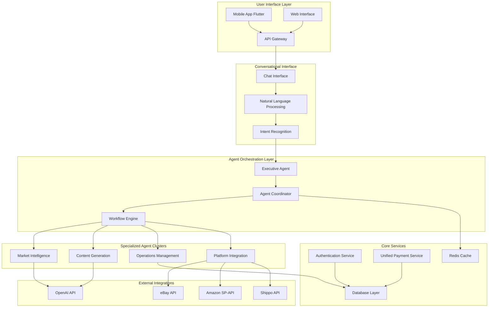

---

## 🤖 **AGENT COORDINATION ARCHITECTURE**

### **39-Agent Ecosystem Map**

```mermaid
graph TD
    subgraph "Executive Layer"
        EXEC[Executive Agent]
        PERF[Performance Monitor]
        RESOURCE[Resource Manager]
    end
    
    subgraph "Market Intelligence Cluster"
        MARKET[Market Analysis Agent]
        PRODUCT[Product Research Agent]
        COMPETITOR[Competitor Analysis Agent]
        TREND[Trend Analysis Agent]
        DEMAND[Demand Forecasting Agent]
    end
    
    subgraph "Content Generation Cluster"
        CONTENT[Content Creation Agent]
        SEO[SEO Optimization Agent]
        IMAGE[Image Analysis Agent]
        COPY[Copywriting Agent]
        TRANSLATION[Translation Agent]
    end
    
    subgraph "Operations Management Cluster"
        INVENTORY[Inventory Management Agent]
        PRICING[Pricing Strategy Agent]
        ORDER[Order Management Agent]
        SHIPPING[Shipping Optimization Agent]
        RETURNS[Returns Processing Agent]
    end
    
    subgraph "Platform Integration Cluster"
        EBAY_AGENT[eBay Integration Agent]
        AMAZON_AGENT[Amazon Integration Agent]
        LISTING[Listing Management Agent]
        SYNC[Data Sync Agent]
        COMPLIANCE[Compliance Monitor Agent]
    end
    
    subgraph "Analytics & Intelligence Cluster"
        ANALYTICS[Analytics Agent]
        REPORTING[Reporting Agent]
        FORECAST[Sales Forecasting Agent]
        OPTIMIZATION[Performance Optimization Agent]
        ALERT[Alert Management Agent]
    end
    
    subgraph "Customer Service Cluster"
        CUSTOMER[Customer Service Agent]
        COMMUNICATION[Communication Agent]
        FEEDBACK[Feedback Analysis Agent]
        SUPPORT[Support Ticket Agent]
        ESCALATION[Escalation Management Agent]
    end
    
    subgraph "Financial Management Cluster"
        FINANCE[Financial Analysis Agent]
        ACCOUNTING[Accounting Agent]
        TAX[Tax Calculation Agent]
        PROFIT[Profit Analysis Agent]
        BUDGET[Budget Management Agent]
    end
    
    EXEC --> MARKET
    EXEC --> CONTENT
    EXEC --> OPERATIONS
    EXEC --> EBAY_AGENT
    EXEC --> ANALYTICS
    EXEC --> CUSTOMER
    EXEC --> FINANCE
    
    PERF --> OPTIMIZATION
    RESOURCE --> BUDGET
```

### **Agent Communication Flow**

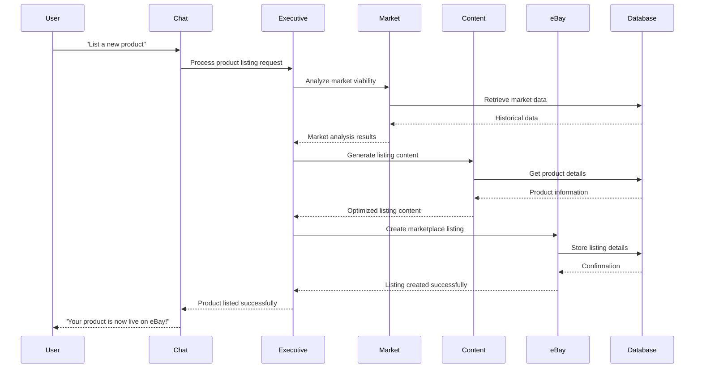

---

## 🔄 **WORKFLOW INTEGRATION PATTERNS**

### **Complete Product Launch Workflow**

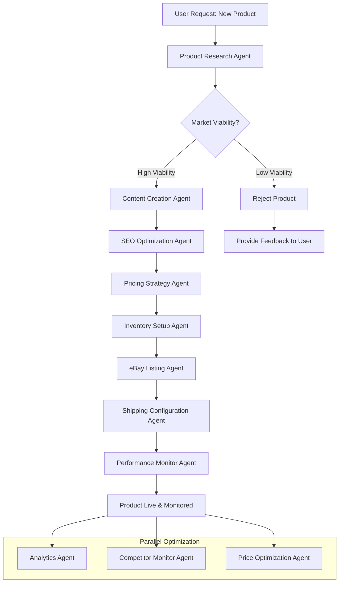

### **Dynamic Pricing Optimization Workflow**

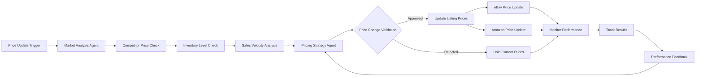

---

## 🔌 **EXTERNAL INTEGRATION ARCHITECTURE**

### **eBay Integration Flow**

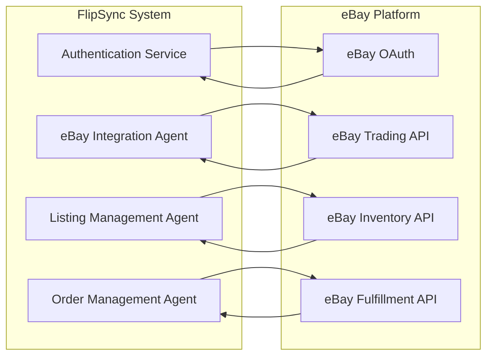

### **OpenAI Integration & Cost Optimization**

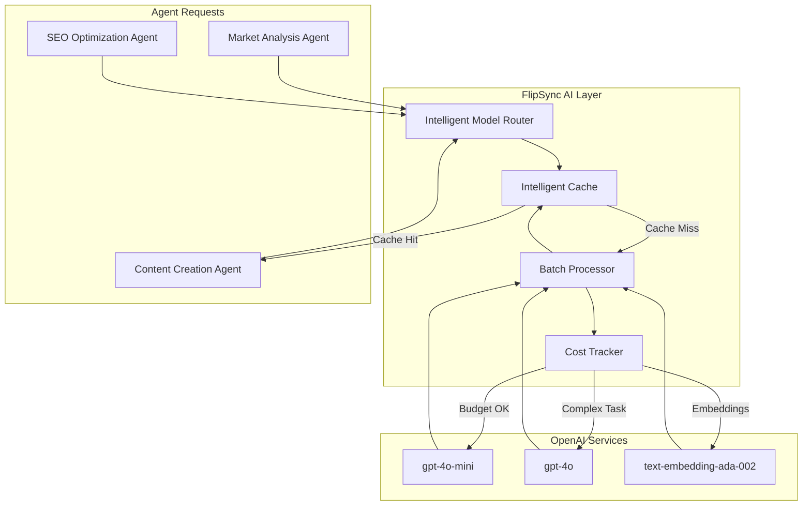

---

## 💾 **DATA FLOW ARCHITECTURE**

### **Database Integration Pattern**

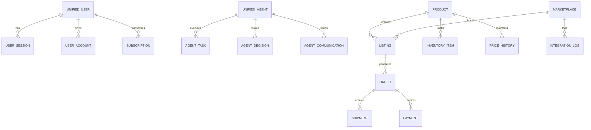

### **Real-Time Data Synchronization**

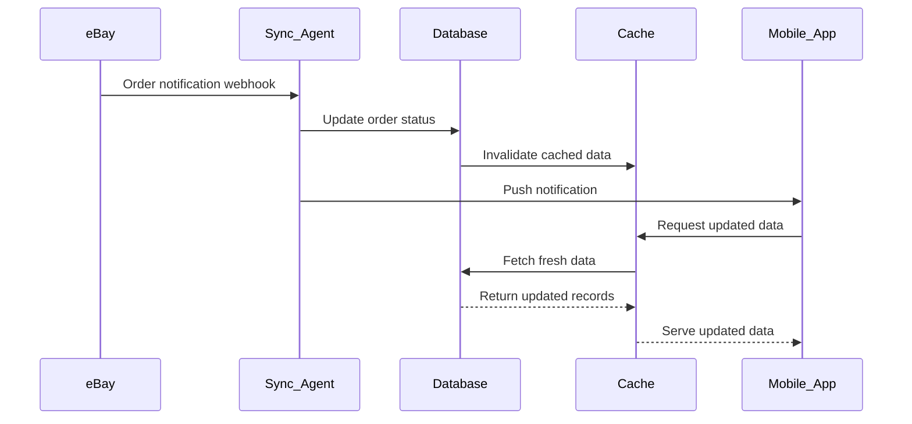

---

## 🔐 **SECURITY & AUTHENTICATION FLOW**

### **Unified Authentication Architecture**

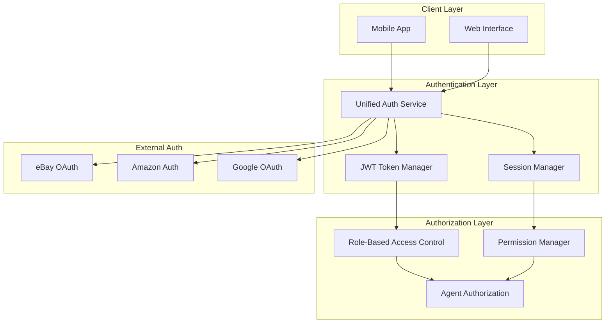

---

## 📊 **MONITORING & ANALYTICS ARCHITECTURE**

### **System Health Monitoring**

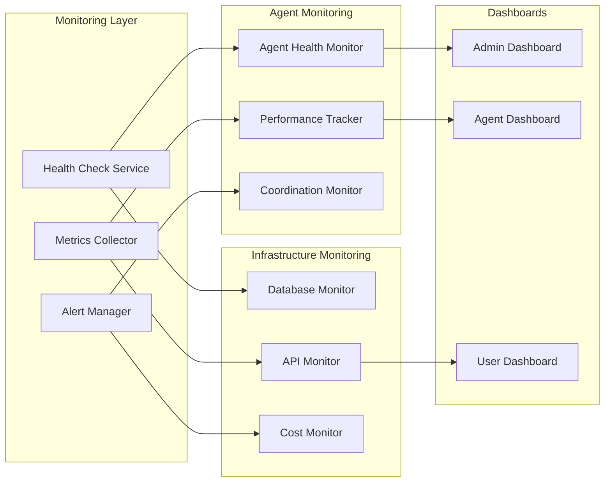

---

## 🚀 **DEPLOYMENT ARCHITECTURE**

### **Docker Container Architecture**

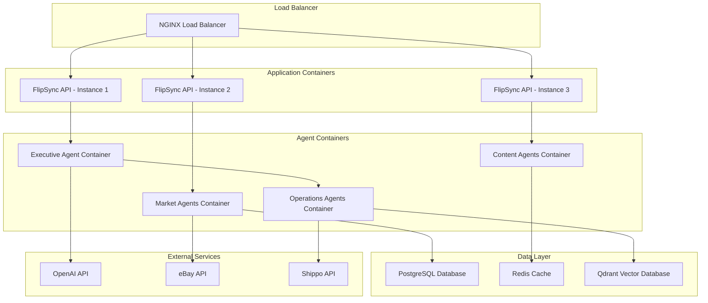

---

## 🎯 **INTEGRATION BEST PRACTICES**

### **API Integration Patterns**
1. **Circuit Breaker**: Prevent cascade failures in external API calls
2. **Retry Logic**: Exponential backoff for transient failures
3. **Rate Limiting**: Respect external API rate limits
4. **Caching**: Aggressive caching for frequently accessed data
5. **Monitoring**: Real-time monitoring of all integration points

### **Agent Coordination Patterns**
1. **Event-Driven**: Asynchronous communication between agents
2. **Hierarchical**: Clear delegation patterns from executive to specialist agents
3. **Fault Tolerant**: Graceful degradation when agents are unavailable
4. **Load Balanced**: Distribute work across available agent instances
5. **Context Aware**: Maintain workflow context across agent handoffs

---

**These diagrams provide the comprehensive visual reference for understanding FlipSync's sophisticated system architecture, agent coordination patterns, and integration flows across the entire 39-agent ecosystem.**
