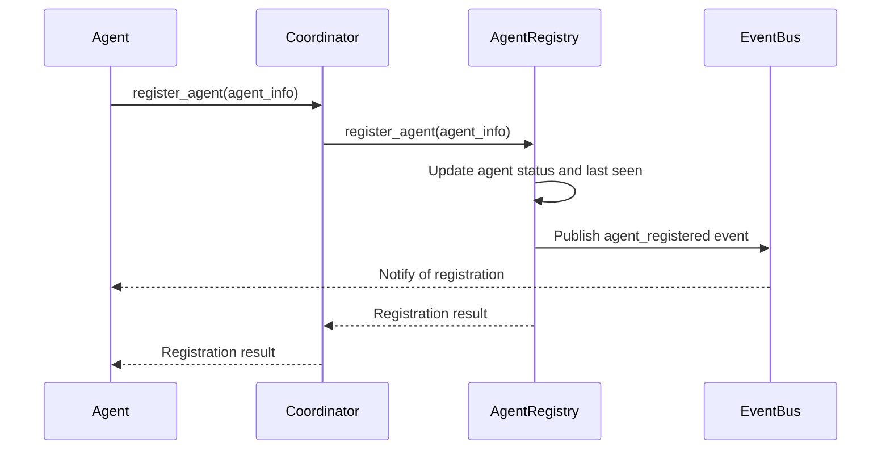
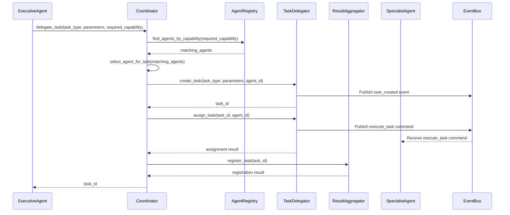
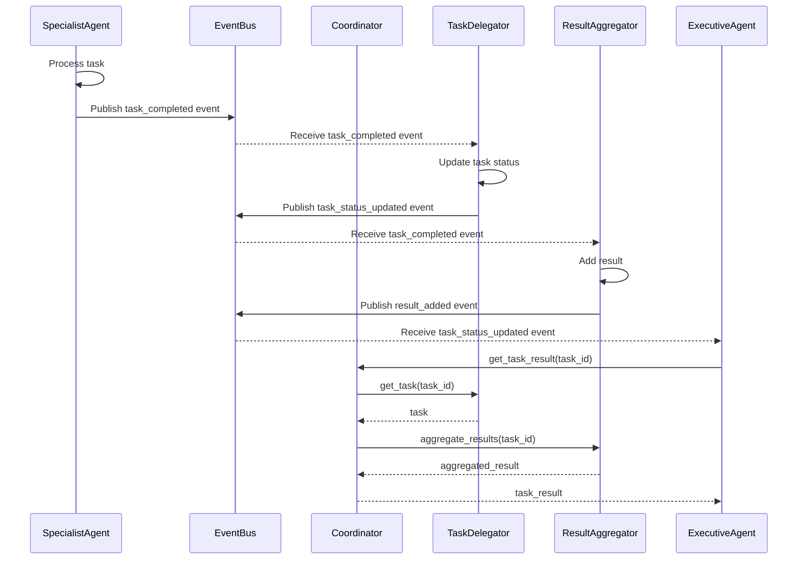
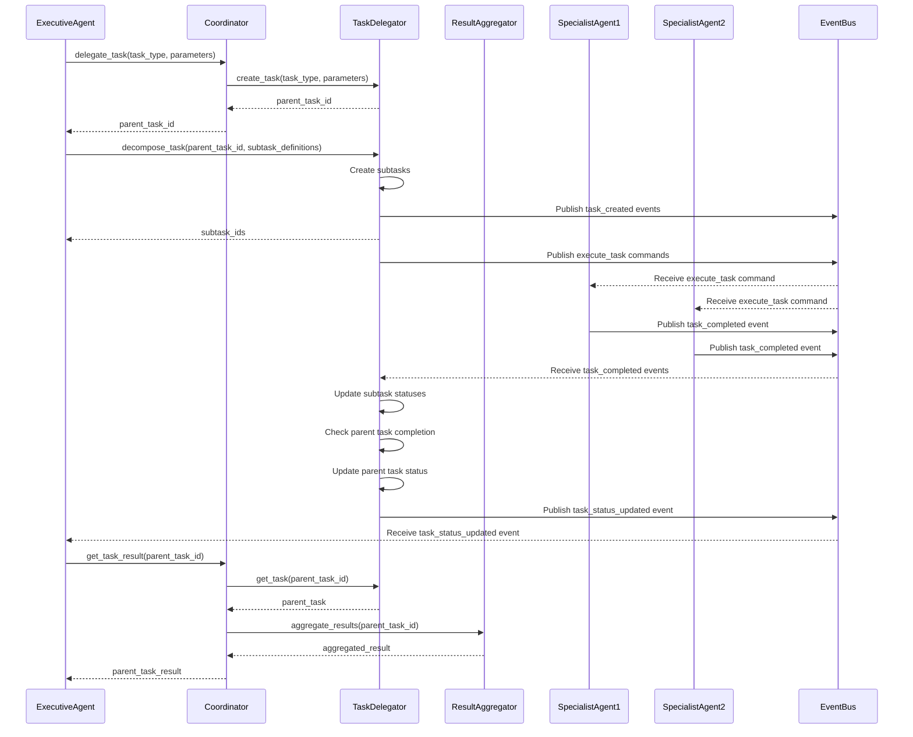
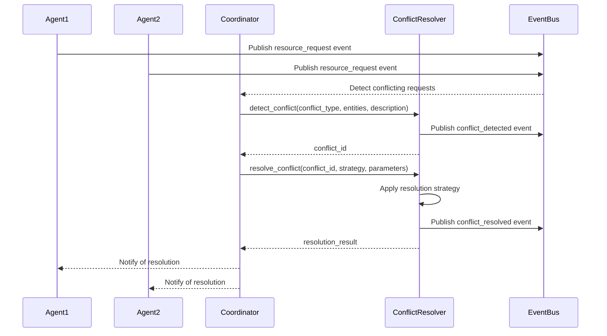
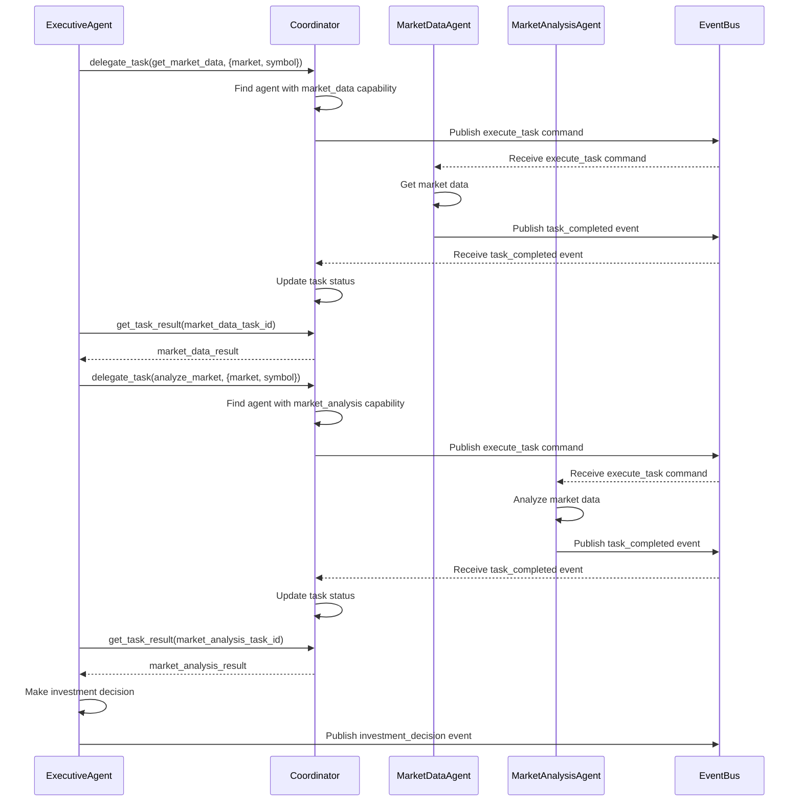
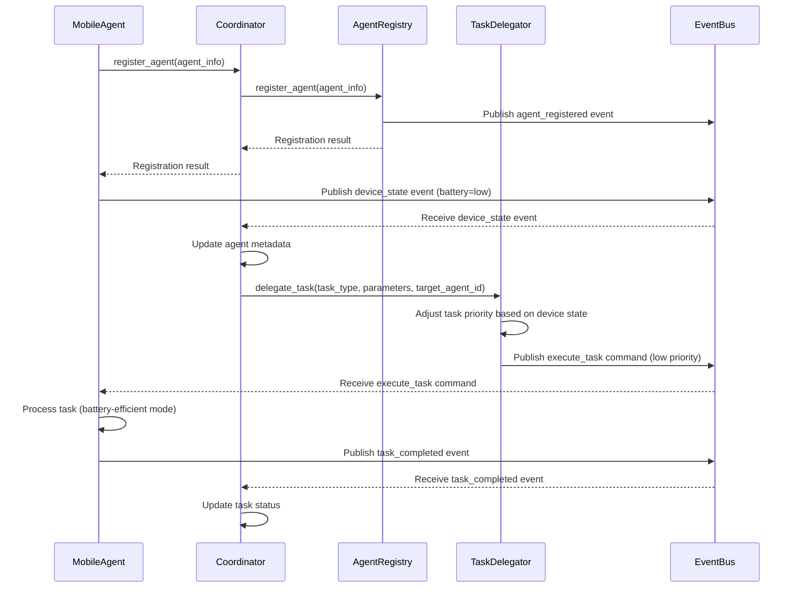

# Coordinator Sequence Diagrams

This document contains sequence diagrams for common coordination flows in the FlipSync application.

## Agent Registration Flow

## Task Delegation Flow

## Task Execution Flow

## Task Decomposition Flow

## Conflict Resolution Flow

## Market Analysis Scenario

## Mobile-Optimized Coordination Flow

