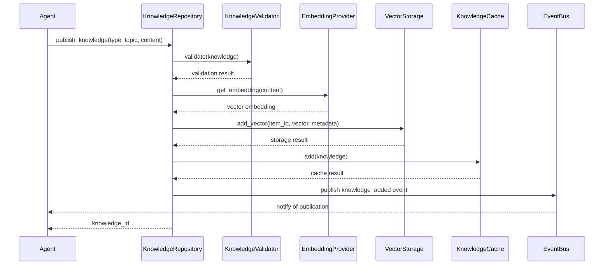
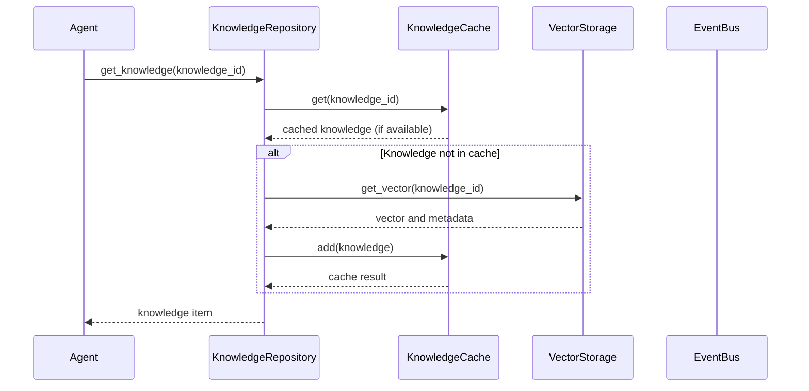
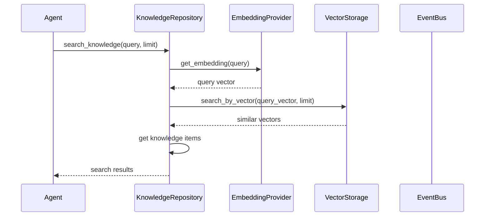
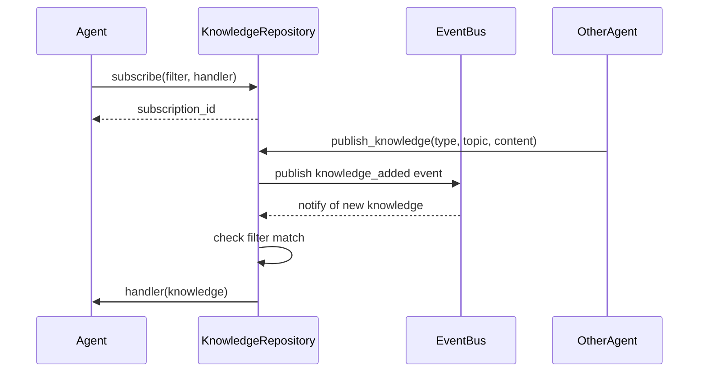
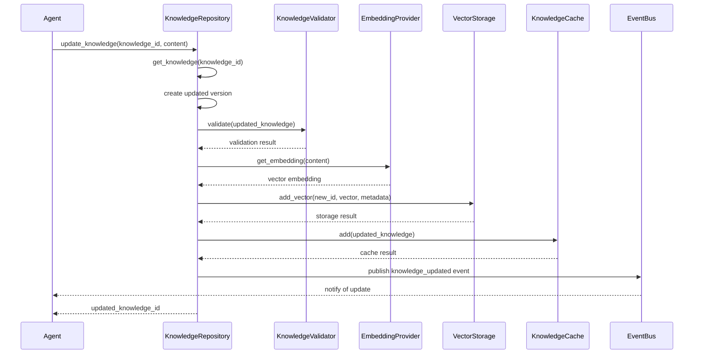
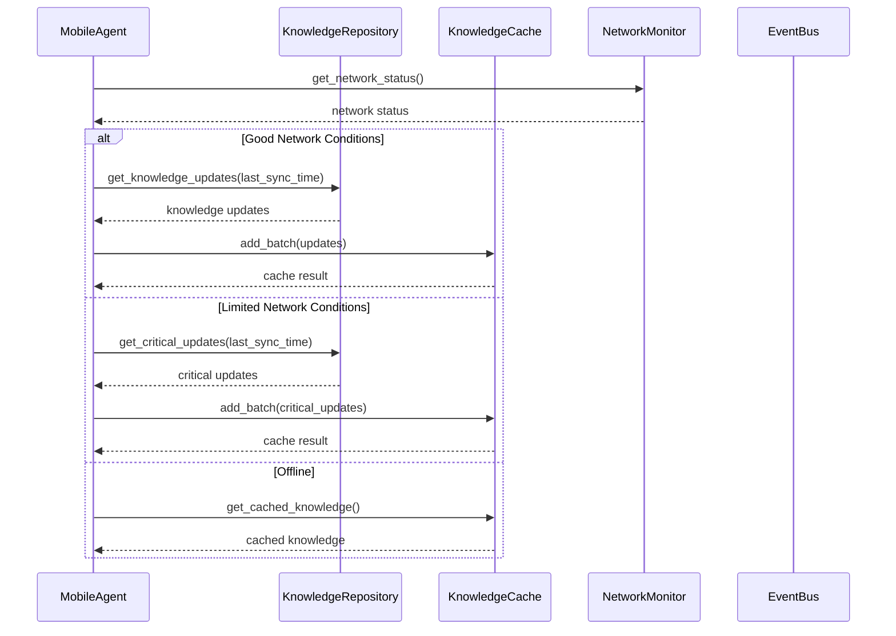
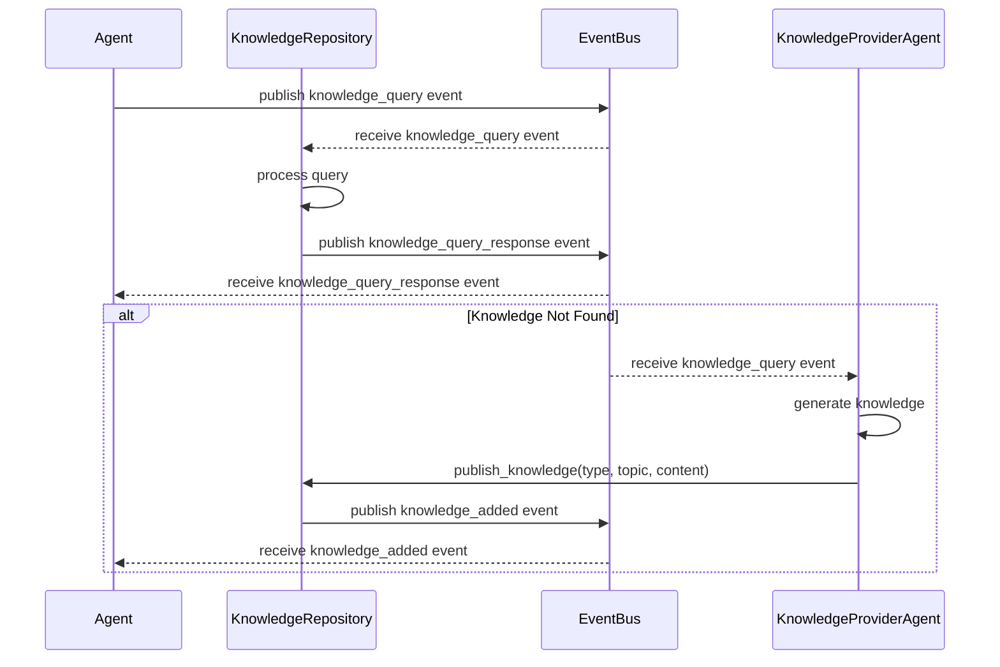
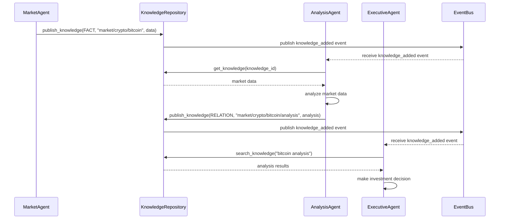
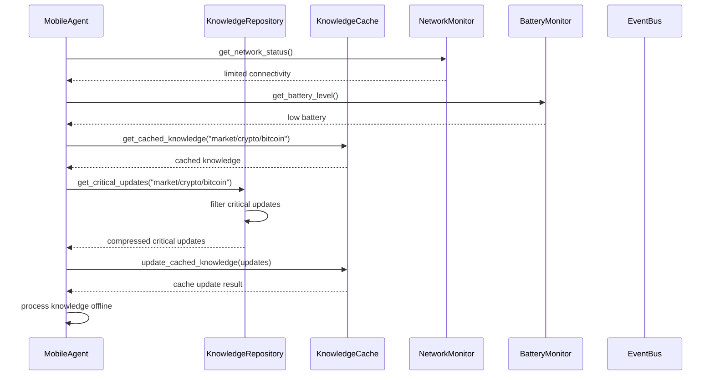

# Knowledge Repository Sequence Diagrams

This document contains sequence diagrams for common knowledge repository flows in the FlipSync application.

## Knowledge Publication Flow

## Knowledge Retrieval Flow

## Knowledge Search Flow

## Knowledge Subscription Flow

## Knowledge Update Flow

## Mobile-Optimized Knowledge Synchronization Flow

## Knowledge Query Flow

## Market Analysis Scenario

## Mobile-Optimized Knowledge Access Scenario

